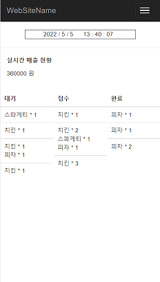

# FirstKitchen - 점주용 POS 

### 📌 Development Environment 
>  **Front-end** 
> - JavaScript
> 
> **Back-end** 
> - Node.js
> - MySQL, Sequelize

 

## 💡 Introduction
공유주방에서 쓰일 POS를 웹 앱으로 제작

## 💡 Demo
### Join Page

### Login Page

- login 성공 시 jwt token 발급

### Main Page

- mission을 완료할 때마다 나무에 꽃이 열린다

### AllMission Page

- 월별로 달성한 미션과 획득한 용돈정보를 표시해준다.

### Setting Page

- maxMoney, paymentDate, connectedEmail, password, phonenumber 를 수정할 수 있는 페이지이다.  

 

## ⚙ Technical Features 
- JWT Token 사용해서 보안 강화 
- GCP로 NodeJS 배포로 `Google` 기술 사용 
- MongoDB Atlas 사용해서 DB도 배포 
